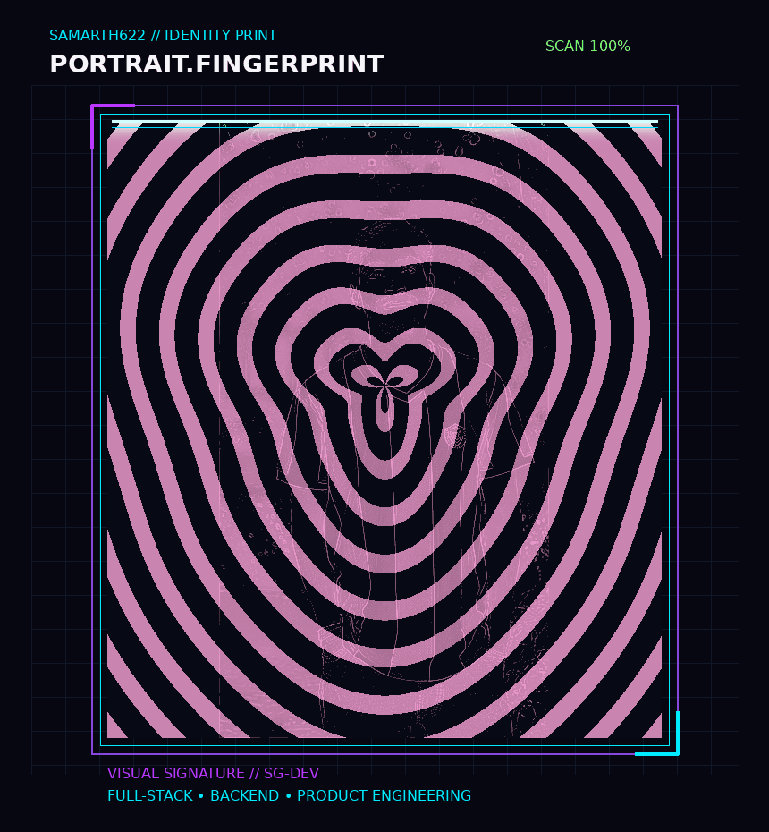

<div align="center">



<br/>

# `SAMMARTH GUPTA`

### `FULL-STACK ENGINEER` · `BACKEND ENGINEER` · `PRODUCT BUILDER`


<br/>

<a href="https://github.com/Samarth622">

</a>
<a href="https://www.linkedin.com/in/samarthgupta622/">

</a>
<a href="https://instagram.com/guptasamarth3471">

</a>
<a href="mailto:guptasamarth622@gmail.com">

</a>

</div>

---

<div align="center">

### `╭────────────────────────────────────────────────────────╮`
### `│              DEVELOPER IDENTITY / ONLINE              │`
### `╰────────────────────────────────────────────────────────╯`

</div>

```text
┌─────────────────────────────────────────────────────────────────────┐
│  NAME        : SAMMARTH GUPTA                                      │
│  ROLE        : FULL-STACK / BACKEND ENGINEER                       │
│  EXPERIENCE  : 3+ YEARS                                            │
│  FOCUS       : APIs • MICROSERVICES • SECURITY • PRODUCT SYSTEMS   │
│  CURRENTLY   : AI FEATURES • JAVA • NODE.JS • SYSTEM DESIGN        │
│  PHILOSOPHY  : BUILD → BREAK → UNDERSTAND → IMPROVE → SHIP        │
└─────────────────────────────────────────────────────────────────────┘
```

> **I like taking an idea from a rough thought to an actual system — designing the backend, building the product, solving the hard parts, and shipping something people can use.**

---

# `01 / ENGINEERING.ARSENAL`

<div align="center">

### `LANGUAGES`


### `BACKEND & ARCHITECTURE`


`REST APIs` · `JWT` · `WebSockets` · `Microservices` · `Service Architecture`

### `FRONTEND`


### `DATA / CLOUD / DEVOPS`


### `TOOLS`


</div>

---

# `02 / KEY.SYSTEMS`

These are the systems I want you to notice first — not because they are the newest repositories, but because they show how I think about **architecture, security, AI and real products**.

<table>
<tr>
<td width="50%" valign="top">

## 🔐 `SECURECHAT`

### End-to-End Encrypted Real-Time Chat

A privacy-focused backend where the server relays encrypted payloads instead of reading message content.

**Architecture**

```text
CLIENT
  ↓
AES-256-GCM
  ↓
RSA-WRAPPED KEY
  ↓
SOCKET.IO
  ↓
NODE / EXPRESS
  ↓
MONGODB
```

**Built with**

`Node.js` `Express.js` `Socket.IO`  
`MongoDB` `JWT` `AES-256-GCM` `RSA`

**[VIEW REPOSITORY →](https://github.com/Samarth622/securechat-backend)**

</td>

<td width="50%" valign="top">

## 🏦 `BANKING CORE`

### Microservices-Based Banking System

A multi-service backend split around separate responsibilities instead of one giant application.

**Architecture**

```text
             API GATEWAY
                  │
      ┌───────────┼───────────┐
      ↓           ↓           ↓
   ACCOUNT     PAYMENT    TRANSACTION
      │           │           │
      └──────┬────┴──────┬────┘
             ↓           ↓
      FRAUD DETECTION  NOTIFICATION
```

**Built with**

`Java` `Spring Boot` `Docker`  
`API Gateway` `Microservices`

**[VIEW REPOSITORY →](https://github.com/Samarth622/Banking-Application)**

</td>
</tr>

<tr>

<td width="50%" valign="top">

## 🤖 `RPF AI SYSTEM`

### AI-Powered Procurement Platform

A full-stack system for RFP generation, vendor management, proposal parsing and AI-assisted proposal comparison.

**Flow**

```text
RFP
 ↓
GEMINI AI
 ↓
VENDORS
 ↓
PROPOSALS
 ↓
AI COMPARISON
 ↓
DECISION
```

**Built with**

`NestJS` `React` `TypeScript`  
`MongoDB` `Gemini` `TailwindCSS`

**[VIEW REPOSITORY →](https://github.com/Samarth622/RPF-AI-SYSTEM)**

</td>

<td width="50%" valign="top">

## 🥗 `FOODLENS`

### Food Intelligence Platform

A product I built around barcode-based food lookup, nutrition analysis, personalization and consumption history.

**Flow**

```text
BARCODE
  ↓
OPENFOODFACTS
  ↓
NORMALIZE
  ↓
NUTRITION ANALYSIS
  ↓
PERSONALIZED INSIGHT
```

**Built with**

`React` `Node.js` `Express.js`  
`MongoDB` `JWT` `REST APIs`

**[BACKEND →](https://github.com/Samarth622/Foodlens-Backend)** · **[LIVE →](http://foodlens.in)**

</td>

</tr>
</table>

---

# `03 / OTHER BUILDS`

| Project | What it explores |
|---|---|
| 🎯 **Trello Clone Backend** | Boards, lists, cards, permissions, JWT auth & recommendation logic |
| 🛒 **E-Commerce Systems** | Full-stack commerce, authentication, products, cart & orders |
| 🧩 **NestJS Authentication** | Modular backend authentication patterns |
| 💳 **Billing System** | React + Spring Boot full-stack architecture |
| 🐞 **BugBuster Backend** | Backend/API engineering |
| 🔗 **Webhook Server** | Event-driven backend communication |
| 🎨 **JSON Visualizer** | Developer tooling & data visualization |
| 💼 **LinkedIn Job Agent** | Automation and job discovery |
| 🎥 **Video Subtitle Generator** | Media tooling & automation |
| 🌐 **3D Web Experiences** | Three.js / GSAP / WebGL experiments |

**[EXPLORE ALL REPOSITORIES →](https://github.com/Samarth622?tab=repositories)**

---

# `04 / ENGINEERING.SIGNAL`

<div align="center">


</div>

<div align="center">


</div>

---

# `05 / ACHIEVEMENTS.UNLOCKED`

```text
╭──────────────────────────────────────────────────────────────╮
│  🥇  1st Rank — Intercollege Coding Hackathon               │
│  🚀  Founder — FoodLens                                      │
│  🧩  1000+ Coding Problems Solved                           │
│  💼  4+ Freelance Projects                                  │
│  ⭐  5-Star Client Feedback                                 │
│  🧱  Microservices + Scalable Backend Systems               │
╰──────────────────────────────────────────────────────────────╯
```

---

# `06 / CURRENT.MISSION`

```text
SYSTEM STATUS : ████████████████████████  ONLINE

[01]  BUILDING     → AI-powered product features
[02]  ENGINEERING  → Scalable backend & microservices
[03]  LEARNING     → System design & deeper architecture
[04]  EXPLORING    → 3D / WebGL / immersive interfaces
[05]  SOLVING      → DSA & difficult engineering problems
[06]  SHIPPING     → Real products, not just tutorials
```

---

# `07 / TERMINAL`

```bash
$ whoami

samarth@developer:~$ full-stack-engineer
samarth@developer:~$ backend-engineer
samarth@developer:~$ product-builder

$ cat philosophy.txt

Build something useful.
Make the architecture clean.
Solve the difficult part.
Learn from what breaks.
Ship it.
Repeat.

$ echo $STATUS

ONLINE ██████████████████████████
```

---

# `08 / CONNECT.WITH.ME`

<div align="center">

### `Have an interesting problem?`

### `Let's build something worth remembering.`

<br/>

<a href="https://www.linkedin.com/in/samarthgupta622/">

</a>

<a href="mailto:guptasamarth622@gmail.com">

</a>

<a href="https://github.com/Samarth622">

</a>

<br/><br/>

`⚡ ALWAYS BUILDING • ALWAYS LEARNING • ALWAYS SHIPPING ⚡`

<br/>


</div>

---

<div align="center">

**`SAMMARTH GUPTA // SYSTEM ONLINE`**

*Made with curiosity, engineering and a slightly unreasonable love for building things.*

</div>
